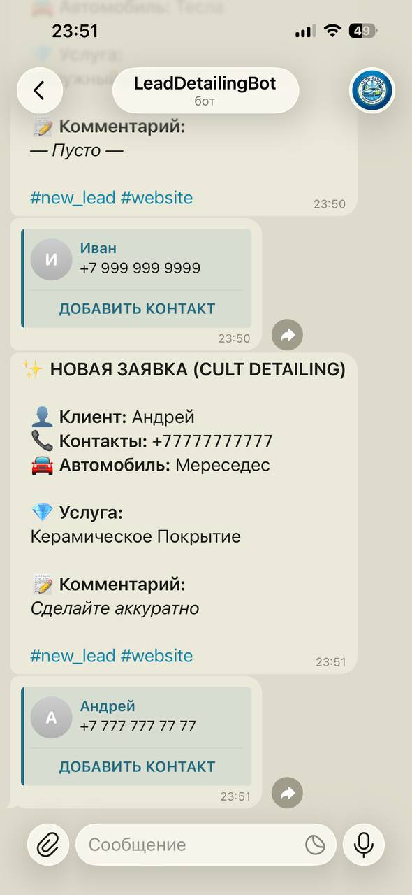

# Cult Detailing — премиум детейлинг студия

Лендинг для студии детейлинга. Сделан на Next.js 15 с упором на
производительность, SEO и конверсии.

## О проекте

Этот сайт решает главную задачу — превращает посетителей в заявки. Никакой воды:
чёткие услуги, понятные цены (в формах), быстрая связь. Сделал упор на визуал и
анимации, чтобы передать премиальность услуг.

Сайт полностью адаптивен, загружается быстро и нормально индексируется
поисковиками.

## Зачем я это сделал

Хотел поработать с Next.js App Router и новыми фишками вроде Server Actions.
Плюс интересно было собрать полноценный проект с нуля — от дизайна в голове до
деплоя. Прокачал скиллы в:

- TypeScript (прописал типы для всех пропсов)
- Server Actions (обработка форм без лишних API роутов)
- Framer Motion (плавные анимации секций)
- SEO (динамические sitemap/robots, JSON-LD разметка)

## Функционал

- Кастомная галерея с фильтрацией по категориям и lightbox
- Форма обратной связи с отправкой в Telegram и Airtable
- Динамические мета-теги и Open Graph для соцсетей
- Адаптивная вёрстка (mobile-first)
- Плавный скролл к секциям
- Masonry-сетка для фотографий работ
- Страницы с политикой конфиденциальности и cookie
- Health check endpoint для мониторинга

## Архитектура и особенности

Проект построен на Next.js 15 с App Router. Структура папок:

- `app/` — страницы и роутинг (группировка через (legal) для документов)
- `components/` — переиспользуемые компоненты (базовые, секции, seo)
- `lib/` — утилиты, типы, конфиги, server actions
- `public/` — статика (изображения, иконки)

Интересные моменты:

- Все данные вынесены в `site-data.ts` — если клиент захочит поменять тексты или
  контакты, не придётся лазить по компонентам
- Server Actions работают без лишних API роутов — форма улетает сразу и в TG, и
  в Airtable
- JSON-LD разметка для локального бизнеса, услуг и FAQ — помогает в выдаче
- Masonry-галерея сделана через CSS columns, без лишних библиотек
- Форматирование телефона в реальном времени — маска +7 (___) ___-__-__

## Стек

**Core:**

- Next.js 15 (App Router)
- TypeScript
- Tailwind CSS v4
- Framer Motion

**UI:**

- shadcn/ui (кастомизированные компоненты)
- Lucide React (иконки)
- next/font (оптимизация шрифтов)

**Backend/Интеграции:**

- Server Actions (отправка форм)
- Telegram Bot API (уведомления)
- Airtable API (хранение лидов)

**SEO:**

- Next.js Metadata API
- JSON-LD разметка
- Динамические sitemap/robots

## Как запустить

1. Клонируй репозиторий:

```bash
git clone https://github.com/B1ZON-c0de/lead-generator.git
cd lead-generator
```

2. Установи зависимости:

```bash
npm install
```

3. Создай файл `.env` из примера:

```bash
cp .env.example .env
```

4. Заполни переменные окружения:

```
TELEGRAM_BOT_TOKEN='токен_бота_от_BotFather'
TELEGRAM_CHAT_ID='id_чата_куда_слать_заявки'
AIRTABLE_TOKEN='токен_из_Airtable'
AIRTABLE_DB_ID='id_базы_данных'
```

5. Запусти дев-сервер:

```bash
npm run dev
```

Сайт будет доступен на `http://localhost:3000`

## Что можно улучшить

- [ ] Добавить админку через Next.js App Router (простую, чтобы менять услуги)
- [ ] Кэширование изображений через Imagekit или Cloudinary
- [ ] Добавить больше состояний загрузки (skeleton)
- [ ] Интеграция с картами (2GIS или Яндекс.Карты)
- [ ] Динамические цены в зависимости от сезона
- [ ] Возможность записаться на конкретное время (календарь)

## Скриншоты

### Главная


### Обратная свзяь в телеграмм

